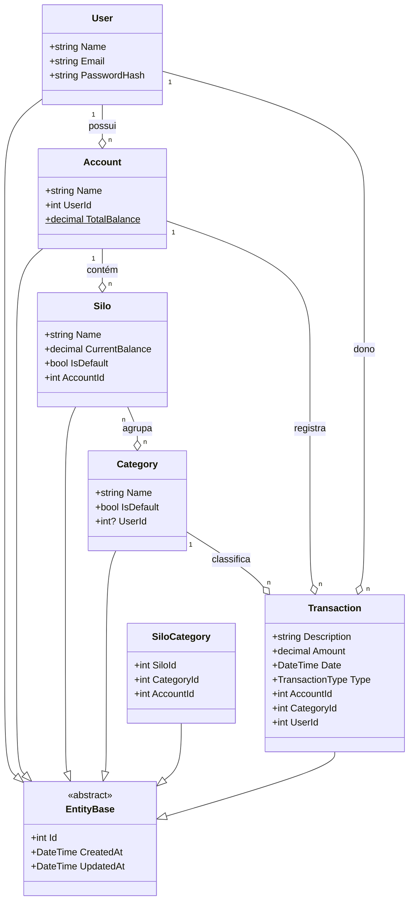

# Architecture Decision Records (ADR) - Silofy

Este documento detalha as decisões de design e arquitetura tomadas durante o desenvolvimento do Silofy.

---

## 1. Design de Domínio (Rich Domain Model)

Diferente de um modelo anêmico, as entidades do Silofy possuem lógica própria.

- **Decisão:** A entidade `Account` possui métodos como `Withdraw()` e `Deposit()`.
- **Motivo:** Garantir que o estado da conta nunca seja inconsistente (ex: saldo negativo sem permissão) antes mesmo de chegar ao banco de dados.

---

## 2. Estrutura de Dados (Diagrama de Classes)

## 3. Estratégia de Persistência

- **Banco de Dados:** PostgreSQL. Escolhido pela robustez com tipos numéricos e suporte nativo no Neon.tech.

- **Unit of Work:** Utilizado via DbContext do EF Core para garantir que a criação de uma transação e a atualização do saldo da conta ocorram na mesma transação atômica (ACID).

## 4. Comunicação Frontend-Backend

- **Padrão:** RESTful API utilizando JSON.

- **Segurança:** Implementação futura de JWT (JSON Web Tokens) para autenticação de usuários.